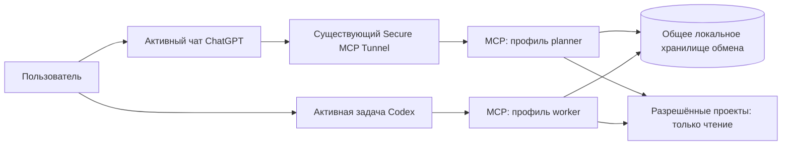

# Этап 3: двусторонний обмен заданиями и отчётами

Дата проекта: 2026-09-10. Обновлено 2026-09-14: функциональная ручная приёмка 0.3.0 пройдена. [Результаты, доказательства и ограничения](experiments/2026-09-14-stage-3-manual-acceptance.md).

## Результат этапа

Пользователь поручает ChatGPT подготовить и передать задание для разрешённого проекта. ChatGPT сохраняет структурированное задание через MCP. Пользователь открывает Codex и поручает обработать это задание; Codex получает его через MCP, явно принимает в работу и публикует структурированный отчёт. ChatGPT по запросу пользователя читает отчёт, проверяет доступные доказательства и фиксирует решение: принять результат или запросить доработку новым связанным заданием.

Критерий успеха — полный цикл с устойчивыми ID и сохранением после перезапуска, без ручного копирования текста между чатами. Автоматический запуск Codex, фоновые уведомления, расписание, shell через MCP, запись в исходники и управление Git в этот этап не входят. Оба клиента могут вызывать инструменты только во время своей активной работы; появление задания в очереди не пробуждает другой чат.

## Основание и границы

В [README](../README.md) и [результатах этапа 2](experiments/2026-09-09-local-project-reading.md) зафиксированы сервер 0.2.0, шесть read-only инструментов и пользовательское подтверждение чтения из ChatGPT и Codex. Версия 0.3.0 реализует описанное здесь расширение, сохраняя строгий конфиг и прежнее поведение при выключенном exchange.

Проектные roots остаются `readOnly: true` для MCP. Новые операции пишут только в отдельное служебное хранилище. Доступ Codex к исходникам, его разрешения на тесты и изменения определяются локальной средой и поручением пользователя. Текст задания, отчёта или прочитанного файла сам по себе не даёт таких разрешений. Правила agent-memory-kit не принимаются автоматически: ссылки на них остаются источниками данных, пока пользователь или проект явно не приняли соответствующие правила.

## Архитектура

Сохраняется stdio-транспорт. Два процесса MCP обращаются к одной локальной SQLite-базе с WAL, транзакциями, внешними ключами, уникальными ограничениями и ограниченным ожиданием блокировки. Выбран `better-sqlite3` 12.2.0: синхронный API позволяет держать изменение состояния, событие и идемпотентный результат в одной короткой транзакции `BEGIN IMMEDIATE`; пакет явно поддерживает Node.js 20.x/22.x/23.x/24.x. Установка и открытие WAL-базы фактически проверены на Windows в текущей среде с Node.js v24.18.1. Встроенный SQLite не используется.

Не размещать базу на сетевом диске или в синхронизируемой папке. Успех мутации возвращается только после commit. Изменение состояния, событие аудита и запись идемпотентности входят в одну транзакцию. Если процесс завершился после commit, но до ответа, повторный вызов возвращает первоначальный результат.

Хранилище располагается вне всех опубликованных project roots. Путь задаёт локальный конфиг, а не аргумент инструмента. При старте проверяются абсолютность, локальность, отсутствие пересечения с roots и links/reparse points в пути. Каталог создаётся с mode `0700` на POSIX. На Windows переносимый Node API не устанавливает и не проверяет точную DACL, а запуск `icacls` из MCP противоречил бы запрету shell/внешних команд; поэтому оператор заранее ограничивает DACL локальным пользователем по инструкции в README. Это явное ограничение реализации, а не защита от другого процесса того же пользователя; TOCTOU-ограничения также сохраняются.

## Подключения и полномочия

Опциональный блок `exchange` в конфигурации содержит `enabled`, `storePath`, `principalId`, `role: planner | worker`, `allowedProjectIds`, `limits`. Отсутствие блока или `enabled: false` сохраняет прежние шесть инструментов и не открывает базу. Все ID проектов должны существовать в локальном реестре; операция проверяет одновременно реестр и allowlist подключения.

Для туннеля используется отдельный локальный конфиг `planner`, для прямого Codex — `worker`; оба указывают одну базу. `principalId` — стабильный неприватный идентификатор подключения, установленный оператором. Клиент не передаёт роль и автора в аргументах. Профили одного `principalId` не могут иметь разные роли. Чтение обмена доступно только для проектов своего allowlist; неизвестные и недоступные сущности возвращают одинаковый `NOT_FOUND`.

Лимиты являются локальными политиками подключения, поэтому профили могут использовать разные значения в допустимом диапазоне. `maxTaskBytes` профиля planner применяется при приёме **нового** задания и должен оставлять запас на весь lifecycle; после записи claim/cancel и последующие переходы проверяются по общему контрактному потолку 32 768 байт, а не по меньшему `maxTaskBytes` другого профиля. Это позволяет, например, worker с `maxTaskBytes: 9216` безопасно принять задание, созданное planner с большим совместимым лимитом. `maxReportBytes` применяется worker при публикации, `maxReviewBytes` — planner при review. Все профили обязаны иметь `maxResponseBytes >= 65600`, чтобы одиночные допустимые Task/Report/Review вместе с обёрткой чтения не оказались нечитаемыми. При разных настройках planner/worker оператор должен обеспечить одинаковые `storePath`, непересекающиеся роли для одного `principalId`, нужные allowlist и указанный минимум ответа; меньшие локальные лимиты записи намеренно могут отклонить новую сущность, но не меняют уже зафиксированный общий формат базы.

| Действие | planner | worker |
| --- | --- | --- |
| Читать задания и отчёты разрешённого проекта | Да | Да |
| Создать задание | Да | Нет |
| Принять задание | Нет | Да |
| Опубликовать отчёт | Нет | Только принявший principal |
| Зафиксировать проверку результата | Только создатель задания | Нет |
| Отменить ещё не принятое задание | Только создатель задания | Нет |

Это разграничение локальных подключений, а не аутентификация человека или конкретной модели. Не доверять `clientInfo`, названию чата или полю «я Codex». Текущая экспериментальная конфигурация ChatGPT использовала No Authentication на уровне MCP; runtime key туннеля не доказывает личность автора задания. Доступ к planner-подключению означает возможность публикации заданий, поэтому worker не исполняет входящую очередь без отдельного поручения пользователя. Более сильная удалённая идентификация — отдельное расширение.

## Контракт данных v1

Все входы строгие, неизвестные поля отклоняются. Время UTC и UUID назначает сервер; `schemaVersion: 1`. Все ссылки принадлежат тому же `projectId`. Свободный текст хранится как данные и не интерпретируется сервером.

**Task:** `taskId`, `projectId`, `createdAt`, `createdBy`, `revision`, `state`, `title`, `objective`, `scope`, `constraints`, `acceptanceCriteria`, `sourceRefs`, опциональный `parentTaskId`, после принятия — `claimedBy`, `claimedAt`, после отмены — `cancelReason`. Последнее поле фиксирует обязательную причину отмены и является минимальным уточнением исходного перечня полей.

- `scope` содержит `allowedPaths` и `outOfScope`: это описание согласованной работы, не техническое разрешение на запись. Пути относительные, без wildcard, абсолютных путей и `..`; для всего проекта используется явный маркер `wholeProject: true` вместо двусмысленного пустого списка.
- `acceptanceCriteria` — непустой список `{ id, description }` со стабильными уникальными ID.
- `sourceRefs` — `{ path, sha256, startLine?, endLine? }`; SHA-256 относится ко всему файлу, как в `read_file`. Оба номера строк задаются вместе. Ссылки на недоступные или исключённые пути отклоняются. Хеш описывает прочитанный автором источник, а не гарантирует его актуальность при исполнении.
- Содержимое задания после создания неизменно. Исправление требований оформляется новым заданием с `parentTaskId`; сервер проверяет существование родителя в том же проекте. Переписывать уже принятое задание нельзя.
- При создании проверяется не только текущий JSON Task, а максимальный размер, достижимый после добавления `claimedBy`, `claimedAt`, `cancelReason`, нового `state` и `revision`. Для резерва используется максимальный допустимый `principalId` и причина отмены предельного JSON-размера. Поэтому новое допустимое queued-задание не может застрять только из-за служебных полей lifecycle.

**Report:** `reportId`, `taskId`, `projectId`, `createdAt`, `createdBy`, `outcome: completed | blocked | failed`, `summary`, `changes`, `checks`, `criterionResults`, `limitations`, `questions`.

- `changes`: `{ path, description, sha256After? }`; файлы автоматически не прикладываются.
- `checks`: `{ description, status: passed | failed | not_run, evidence }`. Текст команды допустим как описание, но сервер его не запускает. Не выполненную проверку нельзя обозначать как passed.
- `criterionResults`: `{ criterionId, status: met | unmet | not_verified, evidence }`; для каждого критерия задания ровно одна запись. `completed` означает заявление исполнителя, а не серверное доказательство или принятие результата.
- `limitations` и `questions` — списки строк; для blocked обязательны причины и хотя бы один вопрос или описание недостающего условия. Отчёт неизменяем; в MVP ровно один финальный отчёт на задание. Промежуточный стриминг и вложения отложены.

**Review:** `reviewId`, `taskId`, `reportId`, `createdAt`, `createdBy`, `decision: accepted | changes_requested`, `comment`. Review относится к точному неизменному отчёту. Принятие означает оценку автора в рамках поручения пользователя и не заменяет разрешения на merge или публикацию. Запрос доработки закрывает текущий цикл; follow-up создаётся отдельным идемпотентным вызовом с `parentTaskId`.

## Состояния и конкуренция

| Операция | Из состояния | В состояние | Условие |
| --- | --- | --- | --- |
| create_task | — | queued | planner и разрешённый проект |
| claim_task | queued | in_progress | worker; атомарное принятие |
| submit_report | in_progress | reported | владелец claim; один отчёт |
| review_report: accepted | reported | accepted | создатель задания |
| review_report: changes_requested | reported | changes_requested | создатель задания |
| cancel_task | queued | cancelled | создатель задания; обязательная причина |

`accepted`, `changes_requested`, `cancelled` — терминальные состояния. `blocked` и `failed` — исходы отчёта, после которых автор также принимает решение о дальнейших действиях. Запретить accepted для отчёта с outcome, отличным от completed; закрывать такие циклы через changes_requested, при необходимости без follow-up.

Каждая мутация существующего задания требует `expectedRevision`; успешная операция увеличивает revision на один. Несовпадение возвращает `CONFLICT` без изменений. Два параллельных claim дают ровно одного победителя. Повторный вызов с тем же ключом идемпотентности сначала ищет сохранённый результат и только потом проверяет revision.

В MVP claim не истекает автоматически: тайм-аут не доказывает, что исполнитель остановился. После перезапуска тот же worker principal продолжает задание; перед публикацией перечитывает его состояние. Автоматического переназначения и отмены выполняющегося задания нет. Если исполнитель потерян, пользователь сначала останавливает его фактическую работу и затем поручает восстановление тому же worker-подключению. Невозможность безопасного takeover — явное ограничение MVP; не создавать конкурирующего исполнителя автоматически.

## MCP-инструменты

Новые инструменты появляются только при включённом exchange и согласно роли. Общие аргументы каждой мутации: `projectId`, `idempotencyKey` (UUID); для существующего задания также `taskId`, `expectedRevision`.

| Инструмент | Дополнительный вход | Результат |
| --- | --- | --- |
| create_task | Поля содержимого Task | taskId, state, revision, createdAt |
| list_tasks | projectId, states?, cursor?, limit? | Краткие карточки, nextCursor |
| get_task | projectId, taskId | Полный Task, reportId?, Review? |
| claim_task | Только общие поля мутации | taskId, state, revision, claimedBy |
| submit_report | Поля содержимого Report | reportId, taskId, state, revision |
| get_report | projectId, reportId | Полный Report |
| review_report | reportId, decision, comment | reviewId, taskId, state, revision |
| cancel_task | reason: до 8 000 кодовых единиц JavaScript и до 8 002 байт сериализованной JSON-строки | taskId, state, revision |

Карточка списка: taskId, title, state, revision, createdAt, claimedBy?, reportId?. Сортировка `(createdAt, taskId)`, keyset cursor с привязкой к projectId и фильтрам. Список отражает текущее состояние: при изменении фильтруемого состояния во время обхода возможны пропуски; новый обход без cursor нужен для сверки очереди. Это не журнал доставки и не snapshot.

Ответы имеют конкретные output schema. Для чтения: `readOnlyHint: true`; для мутаций: `readOnlyHint: false`, `idempotentHint: true` при обязательном ключе, `openWorldHint: false`. Для cancel — `destructiveHint: true`, остальных операций — false, поскольку история не удаляется. Аннотации не заменяют серверных проверок прав.

Ключ уникален в `(principalId, tool, idempotencyKey)`. Хранится хеш канонического валидированного payload со всеми аргументами, включая projectId и expectedRevision. Идентичный повтор возвращает прежний результат; другой payload — `IDEMPOTENCY_CONFLICT`. Авторизация проверяется и для повторов. Успешные ключи живут столько же, сколько история обмена; ошибки валидации и временные ошибки не резервируют ключ. Семантика: повторяемая доставка с единственным эффектом мутации, без обещания exactly-once исполнения кода.

Безопасные ошибки: `NOT_FOUND`, `FORBIDDEN` для запрещённой роли, `INVALID_INPUT`, `CONFLICT`, `INVALID_STATE`, `IDEMPOTENCY_CONFLICT`, `LIMIT_EXCEEDED`, `STORAGE_BUSY`, `STORAGE_UNAVAILABLE`. Ошибка содержит code, безопасное message, correlationId, retryable. После неопределённого результата записи повторять исходный запрос с исходным ключом; после CONFLICT перечитать задание и сформировать новую операцию с новым ключом. Пути базы, SQL и stack trace наружу не выдаются.

## Хранение и лимиты

Таблицы: `tasks`, `reports`, `reviews`, `events`, `idempotency`, `schema_meta`. У reports уникальный taskId, у reviews уникальный reportId. Проверки переходов выполняются транзакционно с условным обновлением revision; ограничения связей защищают соответствие projectId/taskId/reportId. Events содержат последовательный ID, тип операции, principalId, ID сущностей, время и revision; свободный текст не дублируется в событиях.

Контрактные потолки не увеличены: Task — 32 768 байт UTF-8 сериализованного JSON, Report — 65 536, Review — 8 192, ответ — 131 072; по 100 элементов в массивах, title до 200 кодовых единиц JavaScript, большинство свободных строк до 8 000. Настраиваемый `maxTaskBytes` имеет диапазон 9 216…32 768, а `maxResponseBytes` — 65 600…131 072. Минимум ответа включает небольшую обёртку `get_task`/`get_report`, в том числе `reportId` и Review. Перед commit сервис проверяет как сущность, так и её соответствующий одиночный ответ. Слишком большой объект не обрезается и операция не оставляет сущность, событие или идемпотентный ключ. `get_task` получает Task, reportId и Review одной SQL-операцией, то есть из одного согласованного снимка SQLite.

«Символ», UTF-8-байт и JSON-байт — разные величины. Входная схема Zod считает длину JavaScript-строки в кодовых единицах UTF-16; кириллица обычно занимает одну такую единицу, emoji — две. Затем сервер сериализует строку через `JSON.stringify`, кодирует результат в UTF-8 и считает байты, включая две внешние кавычки и экранирование. Поэтому причина отмены ограничена одновременно 8 000 кодовыми единицами входной схемы и 8 002 UTF-8-байтами сериализованной JSON-строки: 8 000 ASCII-символов дают 8 002 байта, 4 000 кириллических символов — 8 002, а 4 000 переводов строки — тоже 8 002 из-за представления `\n`; 4 001 кириллический символ или перевод строки уже дают 8 004 и отклоняются с `LIMIT_EXCEEDED`. Нулевой символ сериализуется как шестибайтная последовательность `\u0000`; для других управляющих символов и кавычек также учитывается JSON-экранирование.

### Совместимость со старыми Task без lifecycle-резерва

Предыдущая реализация могла сохранить queued Task, чей исходный JSON занимал ровно 32 768 байт, не оставив места для служебных полей. Такой объект по-прежнему читается без изменения и не мигрируется автоматически. Если безопасный claim или cancel превысил бы неизменный контрактный потолок, сервер возвращает `INVALID_STATE` с указанием на offline recovery; транзакция откатывается, поэтому состояние, байты сущности, история событий и идемпотентный ключ сохраняются. Это **не исправленная переходная совместимость**: старое задание остаётся queued и требует административного восстановления.

Процедура восстановления выполняется локальным оператором:

1. Остановить оба stdio-подключения planner и worker и убедиться, что ни один процесс не держит базу.
2. Создать согласованную резервную копию SQLite средствами backup API, например из корня проекта: `node -e "const D=require('better-sqlite3'); const db=new D(process.argv[1],{readonly:true}); db.backup(process.argv[2]).then(()=>db.close())" "C:\\absolute\\exchange.sqlite" "C:\\absolute\\backup.sqlite"`. Простая копия открытой WAL-базы недостаточна.
3. Запустить только planner, прочитать старое задание через `get_task` и сохранить его `taskId`; не редактировать `entity_json`, таблицы событий или ключи SQL-командами.
4. Создать новое уменьшенное задание с `parentTaskId` старого Task и теми же существенными требованиями, затем выполнить обычный цикл через worker. Старое задание остаётся в исходной базе как неизменяемая история со статусом queued.
5. Если queued-запись мешает эксплуатации, после резервной копии и при остановленных подключениях вручную настроить **оба** локальных профиля на новое пустое `storePath`. История останется доступна только при возврате к архивной базе; MCP намеренно не удаляет и не переписывает старую запись.

До 10 000 заданий и 256 MiB логического содержимого истории, событий и ключей на хранилище; проверка квот входит в транзакцию. Это не точный предел размера SQLite/WAL на диске. Нет автоматического удаления: при квоте запись отклоняется, чтение остаётся доступно. Резервное копирование и очистка — локальная административная процедура при остановленных обоих подключениях; удаление через MCP не предоставляется. Перед миграцией делается согласованная резервная копия; неизвестная версия схемы блокирует exchange, а не запускает разрушительную миграцию.

Логи сохраняют только название инструмента, correlationId, длительность и безопасный код результата по существующей политике. Задания, отчёты, evidence, ключи и абсолютные пути не логируются. Хранилище содержит пользовательский текст; denylist путей не обнаруживает секреты в произвольном тексте. База и локальные конфиги не должны попадать в Git.

## Сценарий взаимодействия

1. Пользователь в ChatGPT: «Подготовь и передай в Codex задание для проекта X: …». ChatGPT читает нужные источники, заполняет критерии и sourceRefs, вызывает create_task и сообщает taskId. Формулировка «спроектируй задание» сама по себе означает подготовку, а не публикацию.
2. Пользователь в Codex: «Возьми задание TASK_ID из обмена проекта X и выполни в пределах его scope». Codex вызывает get_task, сопоставляет проект с текущей рабочей папкой, читает действующие локальные правила и проверяет sourceRefs. Если источники изменились или поручение несовместимо с правилами, не начинает изменения; после claim публикует blocked с конкретной причиной.
3. При допустимой работе Codex вызывает claim_task с актуальной revision, выполняет задачу средствами своей среды и вызывает submit_report. В отчёте отделяет выполненные проверки от планируемых, указывает изменения и ограничения. Потеря MCP после изменения исходников не означает, что код откатился: исполнитель повторяет доставку отчёта, а не исполнение задания.
4. Пользователь в ChatGPT: «Прочитай отчёт по TASK_ID и проверь результат». ChatGPT вызывает get_task/get_report, при необходимости перечитывает изменённые доступные файлы. Текст отчёта о тестах остаётся утверждением исполнителя: чтение исходника не подтверждает запуск теста.
5. Если пользователь поручил зафиксировать решение, ChatGPT вызывает review_report. При необходимости нового цикла создаёт follow-up с parentTaskId и новым полным scope/критериями. Простое чтение отчёта не меняет статус и не означает принятие.

Первую приёмку проводить на временном разрешённом проекте с безвредной задачей: создать краткий файл документации локальными средствами Codex, проверить его через read_file в ChatGPT, принять отчёт. Не включать обмен для всех существующих проектов автоматически.

## Реализация 0.3.0

1. Строгие типы и схемы находятся в `src/exchange/schemas.ts`; опциональная конфигурация и валидация ролей/путей — в `src/config.ts`. Старые конфиги сохраняют поведение.
2. `src/exchange/store.ts` реализует схему v1, WAL, транзакции, CAS revision, квоты и идемпотентность на `better-sqlite3`.
3. `src/exchange/service.ts` реализует права, project scoping, переходы и безопасные ошибки; `src/exchange/tools.ts` регистрирует инструменты согласно роли. Старые шесть инструментов и их read-only-аннотации сохранены.
4. Добавлены `config/example-planner.json` и `config/example-worker.json`, инструкция явного включения и разграничение read-only roots/служебной записи. Пользовательские локальные конфиги, лаунчер и туннель не переключались.
5. Интеграционные автотесты готовы. Ручная приёмка ChatGPT → Codex → ChatGPT остаётся отдельным обязательным шагом и после выполнения сохраняется в `docs/experiments`.

## Проверки и критерии приёмки

Автотесты через настоящий MCP-клиент SDK и временную базу:

- Без exchange доступны прежние шесть инструментов; с exchange discovery соответствует роли, все схемы строгие, аннотации корректны.
- Полный цикл queued → in_progress → reported → accepted; ветки cancelled, blocked/failed и changes_requested с follow-up. Недопустимые переходы не оставляют частичных записей.
- Повтор каждой мутации возвращает исходные ID; изменённый payload под тем же ключом отклоняется. Потеря ответа после commit и перезапуск не дублируют сущности.
- Два самостоятельных stdio-процесса одновременно принимают одно задание: один успех; чужой worker не публикует отчёт. Устаревшая revision не перезаписывает новое состояние.
- Проверка роли, allowlist, чужого projectId, подмены task/report ID и запрета произвольных путей записи; база внутри project root, traversal и links отклоняются. Исходники fixtures остаются побайтово неизменными от всех MCP-мутаций.
- Лимиты UTF-8, курсоры, невалидные ссылки/критерии, квоты, занятая/недоступная база, неподдерживаемая версия схемы. Секретоподобный контрольный текст не появляется в stderr и ошибках.
- Текст задания с инструкцией запустить shell не вызывает процессов со стороны MCP. Соблюдение инструкций самой моделью оценивается отдельно от тестов сервера.

Ручная приёмка сохраняет версии клиента/сервера, taskId/reportId/reviewId, фактические структурированные результаты без секретов, подтверждение перезапуска и повторного чтения. Проверяется доставка в обе стороны, доработка вторым заданием и отсутствие автоматического запуска исполнителя. Заявления о расходе лимитов, автоматическом принятии skills и фоновой работе не включаются в результат этапа.

Историческая локальная проверка первоначальной реализации 0.3.0 от 2026-09-10 завершалась успешно: `npm.cmd run typecheck` — код 0; `npm.cmd test` — код 0, 9 тестов из 9. Это зафиксированный прежний результат, а не число тестов текущей версии.

Повторная проверка после исправлений аудита от 2026-09-10: `npm.cmd run typecheck` — код 0; `npm.cmd test` — код 0, 14 тестов из 14. Тесты используют официальный MCP TypeScript SDK и реальные stdio-процессы, временные project fixtures и отдельные SQLite-базы. Помимо discovery ролей, полного цикла, перезапусков, конкурентного claim, идемпотентности, прав, состояний, revision, квот и ошибок хранилища проверены UTF-8-границы нового Task с последующими claim/cancel при разных лимитах профилей, старая queued-запись ровно 32 768 байт, границы ASCII/кириллицы/JSON-экранирования причины отмены, отсутствие частичных записей и согласованность `get_task` при конкурентной мутации. Это не фактическая проверка через интерфейсы ChatGPT и Codex.

Этап завершён только после успешных `typecheck`, тестов и подтверждённого полного ручного цикла в обоих клиентах. Код и package metadata имеют версию 0.3.0. Функциональная ручная приёмка подтверждена 2026-09-14; результаты и ограничения запуска туннеля сохранены в docs/experiments/2026-09-14-stage-3-manual-acceptance.md.

Финальная проверка перед коммитом от 2026-09-14: build и typecheck прошли, 15/15 тестов. Новый регрессионный тест проверяет диагностику полей строгой схемы, отсутствие отражения чувствительных значений и возможность исправить запрос с тем же ещё не использованным ключом.
